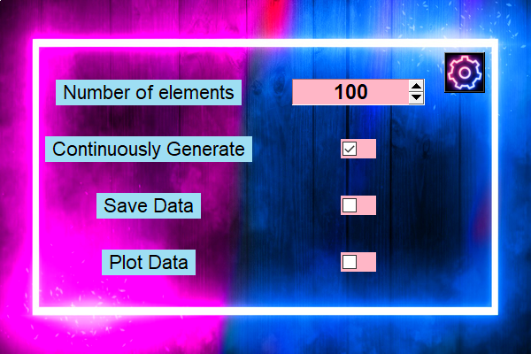
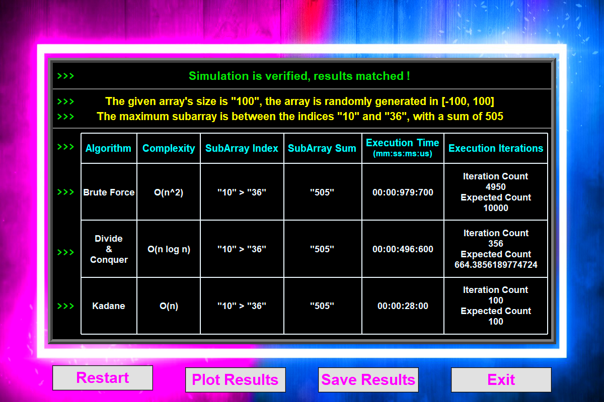
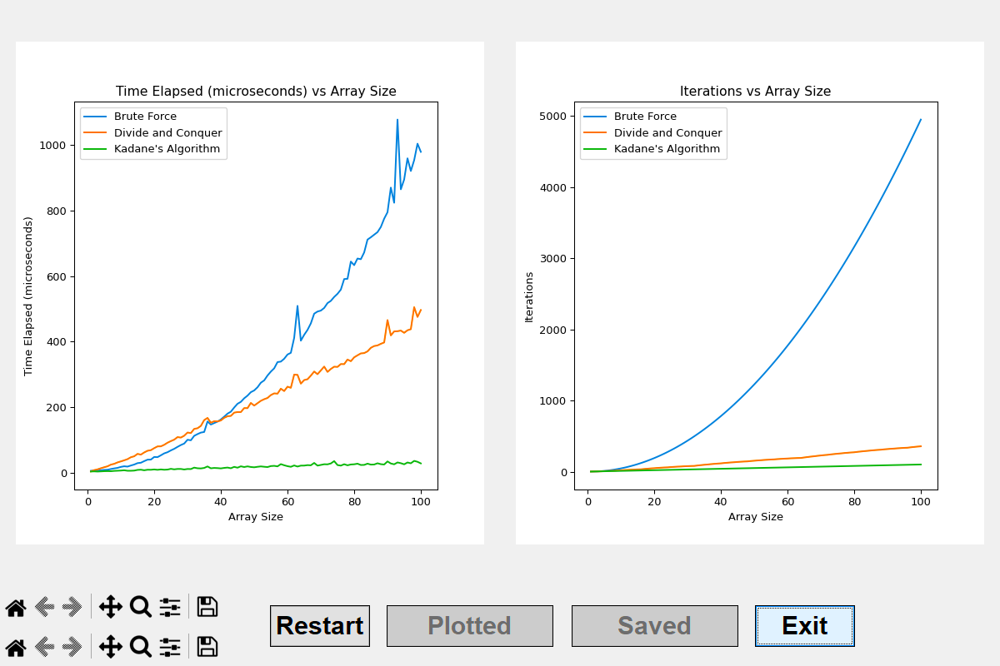

# Welcome to the Max SubArray Project.

This project is a simple implementation of the Max SubArray problem. To analyze algorithm erficiency, the project uses the following algorithms:

* 1. Brute Force
* 2. Divide and Conquer
* 3. Linear

The project also includes a simple test suite to test the algorithms.

# To run the project.

install requirements for python packages, then run one of the following python scripts:

1. main.py - runs the test suite and prints the results.
2. application.py - runs the application and prints the results.

# See images for sample output.

